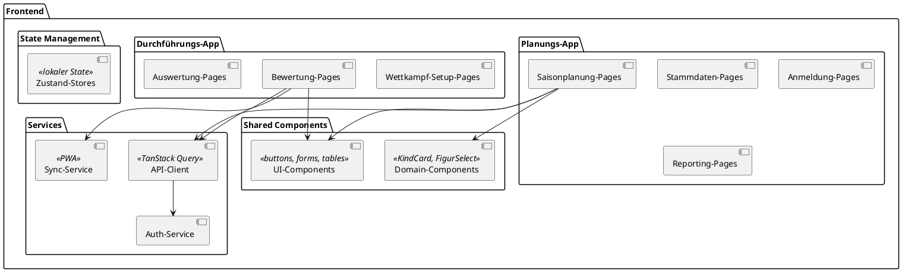

# Bausteinsicht - Aquarius

**arc42 Kapitel 5**

---

## 5.1 Whitebox Gesamtsystem (Level 0)

Das Aquarius-System besteht aus zwei Hauptanwendungen, die auf einem gemeinsamen Backend operieren:

```plantuml
@startuml
!include https://raw.githubusercontent.com/plantuml-stdlib/C4-PlantUML/master/C4_Container.puml

LAYOUT_WITH_LEGEND()

Person(praesident, "Präsident", "Plant Saison und Wettkämpfe")
Person(verein, "Verein", "Meldet Kinder an")
Person(punktrichter, "Punktrichter", "Verwaltet Wettkampf vor Ort")
Person(kampfrichter, "Kampfrichter", "Bewertet Starts")

System_Boundary(aquarius, "Aquarius") {
    Container(planning_app, "Planungs-App", "React SPA", "Desktop-optimierte Oberfläche für Verwaltung und Planung")
    Container(execution_app, "Durchführungs-App", "React PWA", "Touch-optimierte Oberfläche für Live-Bewertung")
    Container(backend, "Backend API", "FastAPI", "REST API, Business-Logik, Datenzugriff")
    ContainerDb(database, "Datenbank", "Turso (libSQL)", "Persistente Speicherung mit Cloud-Sync")
}

Rel(praesident, planning_app, "Plant Saison, verwaltet Stammdaten", "HTTPS")
Rel(verein, planning_app, "Meldet Kinder an", "HTTPS")
Rel(punktrichter, execution_app, "Führt Wettkampf durch", "HTTPS/Offline")
Rel(kampfrichter, execution_app, "Erfasst Punkte", "HTTPS/Offline")

Rel(planning_app, backend, "API Calls", "JSON/HTTPS")
Rel(execution_app, backend, "API Calls + Sync", "JSON/HTTPS")
Rel(backend, database, "SQL Queries", "libSQL Protocol")

@enduml
```

**Begründung:**
- **Zwei Frontend-Anwendungen** für unterschiedliche Nutzungskontexte (Büro vs. Schwimmbad)
- **Ein Backend** für zentrale Business-Logik und Datenkonsistenz
- **Eine Datenbank** mit Cloud-Sync für hybride Online/Offline-Nutzung

---

## 5.2 Bausteinsicht Level 1 - Backend-Module

Das Backend ist in **6 fachliche Module** (Bounded Contexts) strukturiert:

```plantuml
@startuml
!include https://raw.githubusercontent.com/plantuml-stdlib/C4-PlantUML/master/C4_Component.puml

LAYOUT_TOP_DOWN()

Container_Boundary(backend, "Backend API") {
    Component(stammdaten, "Stammdaten", "Modul", "Vereine, Teams, Kinder, Offizielle")
    Component(saisonplanung, "Saisonplanung", "Modul", "Saison, Figuren, Wettkämpfe, Schwimmbäder")
    Component(anmeldung, "Anmeldung", "Modul", "Wettkampfanmeldungen, Startnummernvergabe")
    Component(wettkampf, "Wettkampf", "Modul", "Stationen, Gruppen, Durchgänge")
    Component(bewertung, "Bewertung", "Modul", "Punkteerfassung, Bewertungsberechnung")
    Component(auswertung, "Auswertung", "Modul", "Ranglisten, Preisvergabe, Export")
}

Rel(anmeldung, stammdaten, "Liest Kinder, Teams", "API")
Rel(anmeldung, saisonplanung, "Liest Wettkämpfe, Figuren", "API")

Rel(wettkampf, anmeldung, "Liest Anmeldungen", "API")
Rel(wettkampf, stammdaten, "Liest Offizielle", "API")

Rel(bewertung, wettkampf, "Liest Durchgänge, Gruppen", "API")
Rel(bewertung, saisonplanung, "Liest Schwierigkeitsfaktoren", "API")

Rel(auswertung, bewertung, "Liest Bewertungen", "API")
Rel(auswertung, wettkampf, "Liest Wettkampfstruktur", "API")

@enduml
```

### Übersicht der Module

| Modul | Verantwortlichkeit | Zentrale Entitäten | Abhängigkeiten |
|-------|-------------------|-------------------|----------------|
| **Stammdaten** | Verwaltung von Basisentitäten | Verein, Team, Kind, Offizieller | - (keine) |
| **Saisonplanung** | Planung von Saison und Wettkämpfen | Saison, Figur, Wettkampf, Schwimmbad | - (keine) |
| **Anmeldung** | Wettkampfanmeldung und Startnummernvergabe | Anmeldung | Stammdaten, Saisonplanung |
| **Wettkampf** | Wettkampfvorbereitung und -struktur | Station, Gruppe, Durchgang | Anmeldung, Stammdaten |
| **Bewertung** | Live-Punkteerfassung und Berechnung | Start, Bewertung | Wettkampf, Saisonplanung |
| **Auswertung** | Ergebnisse und Ranglisten | Rangliste, Preis | Bewertung, Wettkampf |

### Abhängigkeitsregeln

1. **Keine zyklischen Abhängigkeiten** zwischen Modulen
2. **Unabhängige Kernmodule:** Stammdaten und Saisonplanung haben keine Abhängigkeiten
3. **Abhängigkeiten nur über API-Schnittstellen**, keine direkten Datenbankzugriffe
4. **Top-Down-Fluss:** Auswertung → Bewertung → Wettkampf → Anmeldung → Basis-Module

---

## 5.3 Level 2 - Modul "Anmeldung" (Beispiel)

Detaillierte Struktur des Anmeldungs-Moduls:

```plantuml
@startuml
package "Anmeldung Modul" {
    [AnmeldungRouter] <<REST>>
    [AnmeldungService] <<Business Logic>>
    [AnmeldungRepository] <<Data Access>>

    package "Domain" {
        class Anmeldung {
            +id: int
            +kind_id: int
            +wettkampf_id: int
            +startnummer: int
            +figuren: List[int]
            +status: AnmeldungStatus
            +erstellt_am: datetime
        }

        enum AnmeldungStatus {
            VORLAEUFIG
            BESTAETIGT
            STORNIERT
        }
    }

    package "Schemas" {
        class AnmeldungCreate <<DTO>>
        class AnmeldungResponse <<DTO>>
    }
}

' Externe Abhängigkeiten
package "Stammdaten Modul" {
    [KindService]
}

package "Saisonplanung Modul" {
    [WettkampfService]
    [FigurService]
}

' Beziehungen
[AnmeldungRouter] --> [AnmeldungService] : verwendet
[AnmeldungService] --> [AnmeldungRepository] : verwendet
[AnmeldungService] --> [KindService] : validiert Kind
[AnmeldungService] --> [WettkampfService] : prüft Verfügbarkeit
[AnmeldungService] --> [FigurService] : validiert Figuren
[AnmeldungRepository] --> Anmeldung : CRUD

[AnmeldungRouter] ..> AnmeldungCreate : empfängt
[AnmeldungRouter] ..> AnmeldungResponse : sendet
@enduml
```

### Schnittstellen des Anmeldungs-Moduls

**Bereitgestellte Schnittstellen (API):**

| Endpoint | Methode | Beschreibung |
|----------|---------|--------------|
| `/api/anmeldungen` | POST | Neue Anmeldung erstellen |
| `/api/anmeldungen/{id}` | GET | Anmeldung abrufen |
| `/api/anmeldungen` | GET | Anmeldungen filtern (nach Kind, Wettkampf) |
| `/api/anmeldungen/{id}` | PUT | Anmeldung ändern (Figuren) |
| `/api/anmeldungen/{id}` | DELETE | Anmeldung stornieren |
| `/api/anmeldungen/{id}/startnummer` | POST | Startnummer vergeben |

**Benötigte Schnittstellen:**

| Modul | Service | Methode | Zweck |
|-------|---------|---------|-------|
| Stammdaten | KindService | `get_kind(id)` | Kind-Validierung |
| Stammdaten | KindService | `ist_startberechtigt(id)` | Berechtigung prüfen |
| Saisonplanung | WettkampfService | `get_wettkampf(id)` | Wettkampf-Validierung |
| Saisonplanung | WettkampfService | `ist_voll(id)` | Kapazität prüfen |
| Saisonplanung | FigurService | `validate_figuren(ids, wettkampf_id)` | Figuren-Validierung |

### Wichtige Algorithmen

**Startnummernvergabe:**

```python
def vergebe_startnummer(self, anmeldung_id: int) -> int:
    """
    Vergibt eine eindeutige Startnummer für einen Wettkampf.

    Algorithmus:
    1. Finde höchste vergebene Startnummer für Wettkampf
    2. Nächste freie Nummer = höchste + 1
    3. Optimistic Lock: Bei Konflikt Retry
    """
    anmeldung = self.repo.find_by_id(anmeldung_id)
    wettkampf_id = anmeldung.wettkampf_id

    max_nummer = self.repo.get_max_startnummer(wettkampf_id)
    neue_nummer = (max_nummer or 0) + 1

    anmeldung.startnummer = neue_nummer
    anmeldung.status = AnmeldungStatus.BESTAETIGT

    try:
        self.repo.save(anmeldung)
    except StaleDataError:
        # Retry bei Konflikt
        return self.vergebe_startnummer(anmeldung_id)

    return neue_nummer
```

---

## 5.4 Level 2 - Modul "Bewertung" (Beispiel)

```plantuml
@startuml
package "Bewertung Modul" {
    [BewertungRouter] <<REST>>
    [BewertungService] <<Business Logic>>
    [BewertungRepository] <<Data Access>>
    [StartRepository] <<Data Access>>

    package "Domain" {
        class Start {
            +id: int
            +durchgang_id: int
            +kind_id: int
            +reihenfolge: int
            +status: StartStatus
        }

        class Bewertung {
            +id: int
            +start_id: int
            +kampfrichter_id: int
            +vorlaeufige_punkte: Decimal
            +timestamp: datetime
        }

        class Endpunkte {
            +start_id: int
            +endpunkte: Decimal
            +gestrichene_werte: List[Decimal]
            +durchschnitt: Decimal
            +schwierigkeitsfaktor: Decimal
        }

        enum StartStatus {
            WARTEND
            AUFGERUFEN
            ABGESCHLOSSEN
        }
    }
}

' Externe Abhängigkeiten
package "Wettkampf Modul" {
    [DurchgangService]
}

package "Saisonplanung Modul" {
    [FigurService]
}

' Beziehungen
[BewertungRouter] --> [BewertungService]
[BewertungService] --> [BewertungRepository]
[BewertungService] --> [StartRepository]
[BewertungService] --> [DurchgangService] : liest Durchgang
[BewertungService] --> [FigurService] : liest Schwierigkeitsfaktor

[BewertungRepository] --> Bewertung
[StartRepository] --> Start
@enduml
```

### Kernalgorithmus: Endpunkteberechnung

```python
def berechne_endpunkte(self, start_id: int) -> Endpunkte:
    """
    Berechnet Endpunkte nach Liga-Regeln:
    1. Höchste und niedrigste Bewertung streichen
    2. Durchschnitt der verbleibenden Bewertungen
    3. Multiplikation mit Schwierigkeitsfaktor

    Beispiel:
    Bewertungen: [7.5, 8.0, 7.0, 8.5, 7.5]
    Gestrichen: 8.5 (höchste), 7.0 (niedrigste)
    Durchschnitt: (7.5 + 8.0 + 7.5) / 3 = 7.67
    Schwierigkeitsfaktor: 2.3
    Endpunkte: 7.67 × 2.3 = 17.64
    """
    bewertungen = self.bewertung_repo.find_by_start(start_id)

    if len(bewertungen) < 3:
        raise ValidationError("Mindestens 3 Bewertungen erforderlich")

    punkte = [b.vorlaeufige_punkte for b in bewertungen]
    punkte_sortiert = sorted(punkte)

    # Höchste und niedrigste streichen
    gestrichene = [punkte_sortiert[0], punkte_sortiert[-1]]
    verbleibende = punkte_sortiert[1:-1]

    # Durchschnitt
    durchschnitt = sum(verbleibende) / len(verbleibende)

    # Schwierigkeitsfaktor holen
    start = self.start_repo.find_by_id(start_id)
    durchgang = self.durchgang_service.get(start.durchgang_id)
    figur = self.figur_service.get(durchgang.figur_id)

    # Endpunkte
    endpunkte_wert = durchschnitt * figur.schwierigkeitsfaktor

    return Endpunkte(
        start_id=start_id,
        endpunkte=round(endpunkte_wert, 2),
        gestrichene_werte=gestrichene,
        durchschnitt=durchschnitt,
        schwierigkeitsfaktor=figur.schwierigkeitsfaktor
    )
```

---

## 5.5 Level 2 - Frontend-Struktur



### Frontend-Module

| Modul | Verantwortlichkeit | Technologie |
|-------|-------------------|-------------|
| **Planungs-App** | Desktop-optimierte Verwaltungs-UI | React Router, komplexe Formulare |
| **Durchführungs-App** | Touch-optimierte Wettkampf-UI | React Router, PWA, große Buttons |
| **Shared Components** | Wiederverwendbare UI-Elemente | Storybook-dokumentiert |
| **API-Client** | Backend-Kommunikation | TanStack Query (Caching, Sync) |
| **Sync-Service** | Offline-Fähigkeit | Service Worker, IndexedDB |

---

## 5.6 Modul-Übergreifende Konzepte

### 5.6.1 Inter-Modul-Kommunikation

**Regel:** Module kommunizieren nur über Service-Schnittstellen, niemals direkt über Repositories.

```python
# ❌ FALSCH: Direkter Repository-Zugriff
class AnmeldungService:
    def __init__(self, db: Session):
        self.kind_repo = KindRepository(db)  # Direkter Zugriff auf fremdes Modul

# ✅ RICHTIG: Über Service-Schnittstelle
class AnmeldungService:
    def __init__(
        self,
        anmeldung_repo: AnmeldungRepository,
        kind_service: KindService  # Über Service-Interface
    ):
        self.anmeldung_repo = anmeldung_repo
        self.kind_service = kind_service
```

### 5.6.2 Schichtenmodell je Modul

Jedes Modul folgt dem 3-Schichten-Modell (siehe Kapitel 8.1.3):

```
┌─────────────────────────┐
│   Router (REST API)     │  ← HTTP-Schnittstelle
└───────────┬─────────────┘
            │
┌───────────▼─────────────┐
│   Service (Business)    │  ← Geschäftslogik
└───────────┬─────────────┘
            │
┌───────────▼─────────────┐
│   Repository (Data)     │  ← Datenzugriff
└─────────────────────────┘
```

---

## 5.7 Design-Entscheidungen

### Warum 6 Module?

| Kriterium | Begründung |
|-----------|------------|
| **Fachliche Kohäsion** | Jedes Modul repräsentiert einen klar abgegrenzten fachlichen Bereich |
| **Lose Kopplung** | Abhängigkeiten nur über Service-Interfaces, keine zyklischen Abhängigkeiten |
| **Teamstruktur** | Module können parallel entwickelt werden |
| **Testbarkeit** | Module isoliert testbar durch Mock-Services |
| **Wartbarkeit** | Änderungen in einem Modul haben begrenzten Impact |

### Warum keine feinere Granularität?

- **Komplexität:** Zu viele Module erhöhen Koordinationsaufwand
- **Performance:** Jede Modulgrenze bedeutet Service-Call (minimieren)
- **Pragmatismus:** 6 Module = sweet spot für Teamgröße 3-5 Entwickler

### Alternative Schnitte (verworfen)

1. **Nach Use-Case:** 10+ Module (zu granular, hoher Overhead)
2. **Nach Entität:** Verein-Modul, Kind-Modul, etc. (schlechte Kohäsion)
3. **Nach UI:** Planungs-Modul, Durchführungs-Modul (vermischt fachliche Concerns)

---

## 5.8 Offene Punkte

- [ ] **Level 3:** Detaillierung weiterer Module (Wettkampf, Auswertung)?
- [ ] **API-Gateway:** Brauchen wir eine Abstraktionsschicht vor den Modulen?
- [ ] **Event-Driven:** Sollten Module über Events kommunizieren? (z.B. "AnmeldungBestätigt")
- [ ] **Shared Kernel:** Gemeinsame Domain-Objekte (z.B. `Altersgruppe`, `Punktzahl`)?

---

**Nächste Schritte:**
1. Review dieser Bausteinsicht
2. Entscheidung über Level-3-Detaillierung
3. Implementierung der Modul-Struktur im Code
